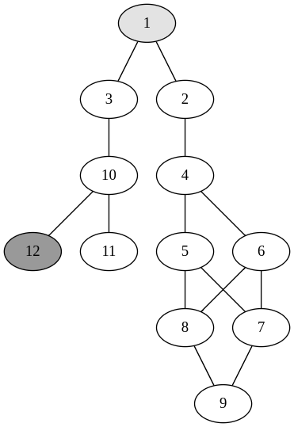

# search_viz

This project runs search algorithms and uses an SDL based submodule to visualize the search trees generated by them.

### Example graph, code representation and search tree generated:

<div style="display:flex;width: 100%; height: 350px; gap:1rem;justify-content:center">

</div>

```c
// ...

// Create graph for BFS Search
// Start: 1; Goal: 12;
CS_SList *adjacency_list = c_structures_s_list_create();
int c1[2] = {1, 3};
int c2[2] = {1, 2};
int c3[2] = {2, 4};
int c4[2] = {4, 5};
int c5[2] = {4, 6};
int c6[2] = {5, 8};
int c7[2] = {5, 7};
int c8[2] = {6, 8};
int c9[2] = {6, 7};
int c10[2] = {8, 9};
int c11[2] = {7, 9};
int c12[2] = {3, 10};
int c13[2] = {10, 11};
int c14[2] = {10, 12};

// ...

// Run dfs search algorith
QP_DfsSearchResults \*dfs_search_results = queen_problem_dfs(adjacency_list, 1, 12);

// ...

// Call render function
queen_problem_render_tree_nested_obj(rend, dfs_search_results->search_tree->root_nodes->head->data);

```

<div style="display:flex;width: 100%; gap:1rem;justify-content:center">

</div>
# Download and run

```shell
$ git clone git@github.com:brunomariz/search_viz.git
$ cd search_viz/
$ git submodule update --init --recursive
$ make
$ ./main
```
